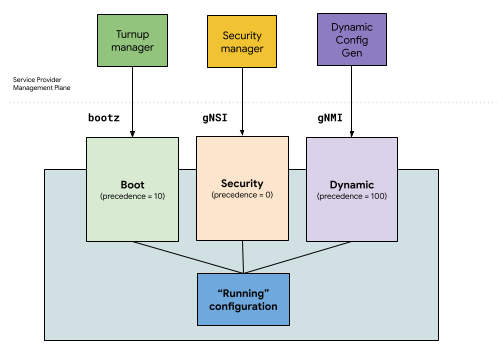
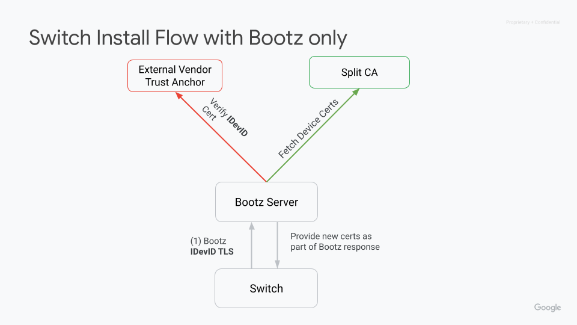
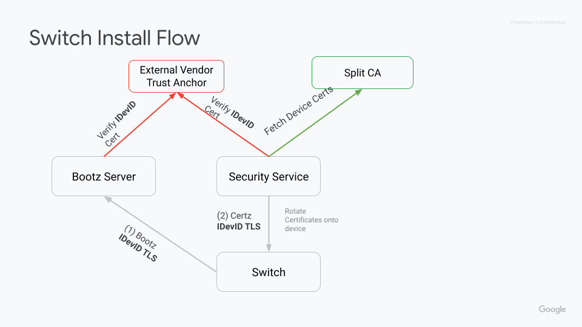
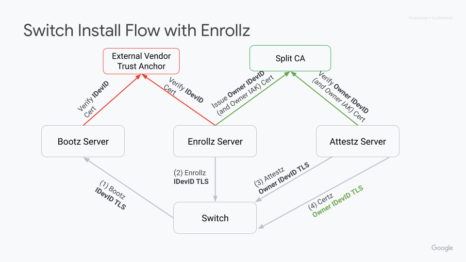

# Bootz protocol v2 (sZTP++ or gZTP)

## Objective

Define a structured data format for exchanging as much data with the network
device as possible, to take the device from a factory state to a fully
production supportable state.

Additionally, define both a dialout and dialin RPC service which can perform the
boot workflow.

The overall design of bootz is meant to allow operators of equipment to provide
a data-only bootstrap request and allow vendors the freedom to implement the
intent based on their own internal APIs.

## Bootstrap/Configuration Management End State

When thinking about what data is needed to transition a "factory-reset" device
from that state into a production-managed state, we can divide the configuration
into multiple units, which differ in how they are managed and interacted with.
This is counter to the current model of vendor network devices which have a
monolithic single configuration that stores all parameters[^1].

For the use cases in our or service provider networks, we consider the following
units:

*   **Boot Config** - Static “bootstrap” configuration required to get a device
    into a manageable state within the network. This configuration includes
    parameters such as the gRPC services that are to run, and the management
    connectivity configuration.
*   **Security Config** - Policies related to provide device access - such as
    authentication and authorization configurations. This configuration
    explicitly controls access to who can write the configuration, read
    parameters from the device via telemetry, and interact with operational
    RPCs. This configuration can be considered to be separate from the base
    device configuration, since it is owned by a separate entity within the
    service provider management plane. It also should not be something that can
    be modified by an entity that is given read access to the configuration.
*   **Dynamic config** - configuration of the device which is generated
    according to the topology, and services that are running on the device.

It is desirable for each of these elements of configuration to each have a
single owner, who is able to declaratively replace the running configuration on
the device without needing to consider contents of the other elements of the
system (i.e., the dynamic configuration manager may be unaware of the bootstrap
configuration, or the authentication configuration).

### Design Options

To support such a concept, there are multiple potential solutions that we can
consider:

#### Path based authorization for configuration

*   This concept still has a single root configuration on the device. Clients
    “own” part of the namespace of this configuration (e.g., `/system/aaa` in
    OpenConfig), controlled by `gnsi.Pathz` configuration.
*   The positive of this approach is that it aligns with existing device
    operational models, with a single configuration (other than `Pathz` exists
    on the device).
*   The major downside of this approach is fragility - the “dynamic”
    configuration described above is the catch-all configuration for the device,
    and would ideally replace `/`, however, it can no longer do this, since
    there exists data under the bootstrap configuration (for example,
    `/interfaces` entries that store the management interfaces) and the security
    configuration that must not be replaced. The “dynamic” configuration then
    must cherry-pick trees that are to be replaced, potentially at relatively
    deep levels in the hierarchy. Bugs or issues with which trees are replaced
    can render the device unmanageable, or can reflect a security problem
    (whereby a client that is not authorized to change security policies is able
    to do so).
*   Equally, authentication policies become more complex in this scenario - we
    imply the existence of a new namespace (`Pathz`), and create this new
    concept of multiple configurations solely to enforce the restrictions on the
    single configuration that we were trying to maintain.

##### Path based implementation details

*   `gnsi.Pathz` policy would limit specific OpenConfig paths from general
    writability
*   The response to the gNMI `SetRequest` that contains the OpenConfig
    configuration change (update, set, delete) is expected to indicate that the
    request failed if those paths are not writable by the caller
*   The full config replace would be responsible for only "replacing" specific
    paths rather than a root level replace
    *   `/system/<subpaths>` but excluding `/system/aaa`, or
        `/interfaces/interface [name=\*]` but exclude
        `/interfaces[name=mgmt0|1]`, this introduces fragility and complexity in
        how the `/interfaces/interface` list or `/system` paths are managed
        since they now have multiple writers.

#### Multiple namespaces for the configuration

*   This is the approach that has been pursued with gNSI - whereby certain
    subsets of the configuration are moved into a separate namespace (origin in
    OpenConfig naming), which is not manipulated via gNMI’s `Set` RPC. To
    support the bootstrap configuration, an additional ‘boot’ configuration
    namespace would be introduced.
*   A disadvantage of this approach is the change that it makes to existing
    device configurations, introducing the concept of multiple potentially
    overlapping configurations.
*   An advantage of the approach is that there is clean separation according to
    the operational use case described above - a gNSI namespace exists for
    policies on the device; the ‘boot’ namespace would exist for configuration
    that is immutable after device boot; and the existing configuration becomes
    the dynamic configuration of the device. Each namespace can have its own
    policies for permissions, and client service. Client services need not know
    about each other’s configuration since replacing a configuration replaces
    only the namespace of that client.

##### Multiple namespace implementation details

*   Data supplied by gNSI is considered as a separate namespace/configuration
    store that is treated independently of configuration interacted with via
    gNMI. All system AAA paths, certificates, keys, accounts and other gNSI
    covered data is contained in this namespace.
*   If gNSI is enabled on the device all of the content covered via gNSI is
    interacted with solely within this namespace. To interact with this content,
    gNSI is used. gNSI `SetRequests` are ACL'ed via `gnsi.Pathz`. Additionally,
    gNSI endpoints would continue to provide set operations as well for those
    configuration elements.
*   OpenConfig and vendor configuration would not be allowed to configure those
    leaves.

#### Explicit exclusion of configuration based on a specification in `gNMI.Set`

*   In this approach, rather than having separate namespaces be defined, a
    client that was performing a `gNMI.Set` request would include some
    additional information (likely defined through having a new extension
    message) that specified a set of paths that explicitly should not be
    modified through the contents of the `SetRequest`. Specifically, this would
    ensure that:
    *   Should the payload of the `SetRequest` specify a path that was in the
        “paths that are not to be modified" list, an error would be returned.
    *   `Replace` operations that give the declarative set of end contents for a
        particular path would exclude these being replaced (e.g., a `replace`
        operation that impacted `/system`, along with a payload that specified
        that `/system/aaa` is not to be modified) would have the semantics of
        replacing the contents of `/system` with that specified, yet leaving
        `/system/aaa` in place.
*   This approach allows for a flexible means by which a scope can be declared
    by a client that knows that there are specific areas of the configuration
    that it is not intending to modify. Since this scope would be declared by
    the client, clearly it is not a security mechanism, and hence `gNSI.Pathz`
    is still required to define the authorisation policy as to which client can
    write to specific parts of the configuration.
*   The downside of this approach is the complexity introduced into the
    implementation of the `Set` handler – and at the client. A client that is
    managing the dynamic configuration must have a definition as to what areas
    of the configuration it does not expect to overwrite, and the target
    implementation must add additional validation code to ensure that the
    transaction had not changed these values.

##### Explicit exclusion implementation details

*   A gNMI `SetRequest` would require the inclusion of a message to indicate
    that a specific set of "exclude paths" are to be honored.
*   These paths would be excluded from the merge / replace operations.
*   Currently, for some implementations this behavior can be achieved via a
    proprietary switch within the vendor-configuration that excludes specific
    paths from being settable from gNMI.
    *   In this implementation any attempts to "set an excluded path" is
        ignored.
    *   This is not advisable as it makes it very opaque during a set as to why
        a set is having a specific output.

### Proposed Solution

We propose to follow the “multiple namespaces for configuration” approach
described above, whereby separate configuration stores, per the diagram and
process below.

Figure 1: Proposed configuration namespaces and clients.

The proposed operational model for devices is shown in Figure 1 above.

*   Security credentials (authorization, accounting, authentication) are
    considered part of security/auth namespace. gNSI manages this configuration
    store completely. It is considered a “precedence 0” store, whereby it is the
    authoritative source of configuration in the case of any overlap with other
    namespaces. Explicitly, this means that gNSI owns this configuration, and
    calls must be made to gNSI to mutate this store.
*   Boot configuration (discussed in more detail in this document) is considered
    part of a bootstrap namespace. gNOI.Bootz manages this configuration store
    completely (proposed and described in this document). Boot configuration is
    considered a “precedence 10” store, with it being the authoritative source
    of configuration in the case of overlaps.
*   Boot configuration is expressly defined to be immutable, and provided only
    at the time of device boot. If the boot configuration is required to be
    modified, it would be changed through calling a `Set` RPC through the
    `Bootz` service.
    *   When changing this configuration the device must "reapply" configuration
        just as would be expected through a controller doing a `gnmi.Set`
        union-merge.
*   Dynamic configuration reflects the current, widely-understood concept of
    configuration on a network device. It is managed via gNMI. Each origin
    within gNMI is assigned an explicit precedence. The precedence for origins
    is defined in the relevant document - but the value suggested is >= 100,
    i.e., for overlaps with other namespaces it is explicitly ignored. It is
    expected that this is needed in the case that:
    *   `/system/aaa` is populated on the device running gNSI. In such a case,
        gNSI (in the auth namespace) is the source of truth.
    *   Management interfaces, or running gRPC daemons are specified in the Boot
        namespace, also in the `/system` or `/interfaces` hierarchies within the
        dynamic configuration.

CLI (via SSH or Console) as an API should have access to all the 3 namespaces
above. It provides a low dependency method to recover the device in case of
bugs/failures/emergencies.

To support this approach, this document proposes a `Bootz` service, which is the
mechanism by which the “boot” namespace is interacted with. **`Bootz` is
proposed to replace the existing zero-touch-provisioning implementations.**

### Background

Currently, the industry standard[^2] is to use the base sZTP protocol for
bootstrapping devices. Current sZTP implementations require vendor specific
definitions for providing the bootstrapping of a device, because there is no
agreed upon vendor neutral data set of “boot configuration” defined. `Bootz`
provides a specification that enumerates the data elements which can be used in
a mainly vendor agnostic way, along with the operations that are required at
turn-up time that become part of the “boot” process. Specifically, we are
suggesting that TPM-related enrollment and attestation should be required during
the boot process to ensure the authenticity and integrity of the device
**before** providing it with potentially sensitive artifacts such as
certificates, keys and device configuration.

### Reference Documentation

*   External
    *   RFC: [RFC8572](https://datatracker.ietf.org/doc/html/rfc8572)
    *   Attestation:
        [Charra Draft](https://datatracker.ietf.org/doc/pdf/draft-ietf-rats-yang-tpm-charra-21#page=5)

### Bootz Operation

Devices are expected to perform a standard DHCP boot. The DHCP server passes a
boot option to the device for an endpoint (URL) from which the boot package can
be retrieved. The package returned by the endpoint consists of a binary encoded
protocol buffer containing all data for being able to complete the boot process.
In this context, “complete the boot process” implies the device reaching a fully
manageable state - with the relevant gRPC services running.

Upon receiving the bootz protocol buffer, the device is responsible for
unmarshalling the bootz message and distributing to the relevant system
components for these artifacts to be acted upon. For example, configuration to a
configuration manager component, keys and credentials to the relevant security
components, etc.

The bootz payload will be encrypted via the TLS session underlying the gRPC
service.

Depending on the security requirement for the deployment environment, after
loading all the provided data on first boot the device might still not be in a
trusted state, however it should have enough g\* services initialized to a state
where the device can be interrogated from a trusted system to enroll the TPM and
validate specific TPM values to attest the device. Once attested, the systems
can install production configuration and certificates into the device.

## Detailed Design

### Boot Procedure (v2)

1.  DHCP Discovery of Bootstrap Server
    1.  Device sends DHCP messages, containing the mac-address of the active
        control card. The DHCP server has been configured with all possible
        mac-addresses of the device, and responds with the static IP address of
        the bootstrap server.
    2.  DHCP server also assigns an IP address and a gateway to the device.
    3.  The DHCP response option code should be `OPTION_V4_SZTP_REDIRECT` (143)
        or `OPTION_V6_SZTP_REDIRECT` (136).
    4.  The format of the DHCP message (other than response option code) follows
        [RFC](https://www.rfc-editor.org/rfc/rfc8572#page-56).
        1.  The URI will be in the format of `bootz://<hostname or ip>:<port>`
2.  Bootstrapping Service
    1.  Device initiates a gRPC connection `Bootstrap.GetBootstrappingData` to
        the bootz-server whose address was obtained from the DHCP server.
    2.  The TLS connection **MUST** be secured on the client-side with the
        IDevID of the active control card.
    3.  The responses from the bootz-server are signed by ownership-certificate.
        The device validates the ownership-voucher, which authenticates the
        ownership-certificate. The device verifies the signature of the message
        body before accepting the message.
    4.  If the signature could not be verified, the bootstrap process starts
        from Step 1.

Note: though a device SHOULD validate ownership by default, in some environment
(e.g. a lab) we might not want to do so. In this case, the device can be
explicitly configured to skip the ownership validation, and the device will then
not set the `nonce` field in the `GetBootstrapDataRequest message`. The
bootstrap server may proceed without signing the response and without providing
the ownership voucher and ownership certificate.

1.  Ownership Voucher and Ownership Certificate
    1.  These artifacts have the same meaning as the original sZTP
        [RFC](https://www.rfc-editor.org/rfc/rfc8572#section-3.2). This document
        uses OC (Ownership Certificate) and PDC (Pinned Domain Cert)
        interchangeably for convenience. However, we should keep in mind that OV
        (Ownership Voucher) authenticates a PDC, and OC might be a distinct
        certificate with a chain of trust to the PDC.
    2.  The contents of the `GetBootstrappingDataResponse` has an inner message
        body. The outer message contains the Ownership Voucher, the Ownership
        Certificate and a signature over the inner message body. The signature
        is generated using the OC and the nonce.
2.  GetBootstrappingData
    1.  The bootz workflow is initiated by the device sending a
        `GetBootstrappingData` gRPC to the bootz-server.
    2.  The device describes itself, by listing out all available control cards,
        and their states.
    3.  For a full device install, the state of all control cards is
        `NOT_INITIALIZED`.
    4.  For installing hot-swapped modules (RMA), the primary control card sets
        its state to `INITIALIZED`, and that of the swapped module to
        `NOT_INITIALIZED`.
3.  GetBootstrappingDataResponse
    1.  The server responds with the intent for the device's baseline state.
        This includes the OS version and boot password hash, and an initial
        device configuration. This would include initial gNSI artifacts such as:
        certz,pathz,authz,credentialz artifacts to allow the device to progress
        to enrollment and attestation or even bring the device fully into a
        production state.
    2.  The proto allows us to return multiple sets of configurations, one per
        control card. However, in practice, we usually apply the same
        configuration to both cards.
    3.  For RMA, the server will return only one set of configuration - for the
        RMA'd module.
    4.  The device/modules should download the OS image, verify its hash and
        install the OS.
        1.  A reboot may be performed, if required.
    5.  The device/modules will then apply the configuration.
        1.  A reboot may be performed, if required.
    6.  The `GetBootstrappingData` gRPC can be performed as many times as
        required (i.e. it is idempotent).
4.  ReportProgress
    1.  This gRPC method is used by the device to inform the bootz server that
        the bootstrapping process is complete. Success or failure is indicated
        using an enum.
    2.  In case of failure, the device should retry this process from Step 1.
    3.  When making this gRPC, the device should verify the identity of the
        server using the "`server_trust_cert`" certificate obtained from
        `GetBootstrappingDataResponse`.
    4.  "`server_trust_cert`" plays the same role as "trust-anchor" in the sZTP
        RFC (i.e. allows the device to verify the identity of the server).
5.  At this point, the device has a minimal set of configuration, enabling it to
    receive gRPC calls. Depending on the operator's security policies, an
    attestation-verification or an enrollment step may be performed.
    1.  At Google, we plan to always require enrollment and
        attestation-verification.
6.  TpmEnrollment
    1.  The enrollment API doc is the authoritative reference for this API. The
        API is reproduced here for convenience.
    2.  This step allows the owner organization to install an owner IAK
        certificate on the device(s). This may be desirable if the owner
        requires periodic rotation of certificates and a revocation policy that
        is independent of the device vendor.
    3.  The TpmEnrollment API is secured with the IDevID certificate.
    4.  During enrollment, the server **MUST** verify that the serial number on
        the Attestation Key certificate matches the serial number on the IDevID
        certificate, and validate both certificates with the appropriate trust
        bundle.
7.  Attestation
    1.  The attestation API doc is the authoritative reference for this API. The
        API is reproduced here for convenience.
    2.  This step allows the owner to obtain cryptographic evidence for the
        integrity of the software components on the control-cards.
    3.  The attestation API should be secured with IDevID for the first
        attestation, and mTLS for subsequent attestations.
        1.  On first attestation, the server **MUST** verify that the serial
            number on the Attestation Key certificate matches the serial number
            on the IDevID certificate, and validate both certificates with the
            appropriate trust bundle.
    4.  On modular devices, the active control card obtains attestation evidence
        from the standby, and relays it to the bootz server. The active control
        card must verify the identity of the standby during this process. The
        standby control card's ability to communicate with the active card is
        not sufficient evidence of identity.
        1.  This specification does not prescribe how to verify the identity of
            the standby, as the communication between the control cards takes
            place over vendor-proprietary protocols. However, at a minimum, the
            active control card must check that the standby's TPM-backed IDevID.
            For example, it may request the IDevID cert, then issue a decrypt
            challenge to the standby control card.
8.  Final state:
    1.  At this point, the device has an initial configuration and user
        accounts. We have validated the identity and integrity of the device and
        its software components. It is ready to serve traffic.

### Bootz Procedure (BootstrapStream)

1.  DHCP Discovery of Bootstrap Server
    1.  Device sends DHCP messages, containing the mac-address of the active
        control card. The DHCP server has been configured with all possible
        mac-addresses of the device, and responds with the static IP address of
        the bootstrap server.
    2.  DHCP server also assigns an IP address and a gateway to the device.
    3.  The DHCP response option code should be `OPTION_V4_SZTP_REDIRECT` (143)
        or `OPTION_V6_SZTP_REDIRECT` (136).
    4.  The format of the DHCP message (other than response option code) follows
        [RFC](https://www.rfc-editor.org/rfc/rfc8572#page-56).
        1.  The URI will be in the format of `bootz://<hostname or ip>:<port>`
2.  Bootstrapping Service
    1.  Device initiates a gRPC connection `Bootstrap.GetBootstrappingData` to
        the bootz-server whose address was obtained from the DHCP server.
    2.  The device **MUST NOT** present a client certificate in the TLS
        handshake.
    3.  The responses from the bootz-server are signed by ownership-certificate.
        The device validates the ownership-voucher, which authenticates the
        ownership-certificate. The device verifies the signature of the message
        body before accepting the message.
    4.  If the signature could not be verified, the bootstrap process starts
        from Step 1.
3.  BootstrapStreamRequest.bootstrap\_request
    1.  The bootz BootstrapStream is initiated by the device sending a
        `GetBootstrapDataRequest` message to the bootz-server in the first
        message of the stream.
    2.  The device describes itself, by listing out all available control cards,
        and their states.
    3.  For a full device install, the state of all control cards is
        `NOT_INITIALIZED`.
    4.  For installing hot-swapped modules (RMA), the primary control card sets
        its state to `INITIALIZED`, and that of the swapped module to
        `NOT_INITIALIZED`.
    5.  The device sets `Identity.ek_pub=true` in the `bootstrap_request` if it
        has a TPM 1.2.
4.  BootstrapStreamResponse.challenge
    1.  The server will provide a challenge depending on the data fetched from
        OVGS (Ownership Voucher gRPC Service) server based on the
        `GetBootstrapDataRequest.identity`.
    2.  For TPM2.0 with IDevID
        1.  The IDevID cert will be validated and the S/N will be used to
            validate the device.
        2.  The Challenge will be returned.
    3.  For non-IDevID systems
        1.  The `GetBootstrapDataRequest.chassis_descriptor` data will be used
            to validate the S/N.
        2.  This will then be validated by lookup in OVGS and then use the keys
            returned to encrypt the challenge.
        3.  For devices which have TPM 1.2, the server sends its certificate
            authority's public key so that the device can send a CSR-like
            request securely.
5.  EkIdentityRequest - Applicable only for devices having TPM 1.2
    1.  The device sends the EK public key and an Identity request to the
        server.
6.  EkIdentityResponse - Applicable only for devices having TPM 1.2
    1.  The server extracts the modulus and exponent from the EK public key, and
        sends a challenge which can be responded only by the intended TPM.
7.  BootstrapStreamRequest.response
    1.  The `Response` message will contain the nonce signed via IAK for TPM 2.0
        system with IDevID. This will validate that the device is in fact the
        device expected.
    2.  For all other systems the returned value will be the unencryted nonce.
    3.  If the challenge response is valid the server will send the bootstrap
        data.
    4.  If the challenge fails an error will be returned and the device must
        start over from Step 1.
8.  BootstrapStreamResponse.bootstrap\_response
    1.  The server responds with the intent for the device's baseline state.
        This includes the OS version and boot password hash, and an initial
        device configuration. This would include initial gNSI artifacts such as:
        certz,pathz,authz,credentialz artifacts to allow the device to progress
        to enrollment and attestation or even bring the device fully into a
        production state.
    2.  The proto allows us to return multiple sets of configurations, one per
        control card. However, in practice, we usually apply the same
        configuration to both cards.
    3.  For RMA, the server will return only one set of configuration - for the
        RMA'd module.
    4.  The device/modules should download the OS image, verify its hash and
        install the OS.
        1.  A reboot may be performed, if required.
    5.  The device/modules will then apply the configuration.
        1.  A reboot may be performed, if required.
9.  BootstrapStreamRequest.report\_status\_request
    1.  The device sends a `ReportStatusRequest` message to the bootz-server.
    2.  If bootstrapping is successful, the device should report all control
        cards as `CONTROL_CARD_STATUS_INITIALIZED` and
        `BOOTSTRAP_STATUS_SUCCESS`.
    3.  If bootstrapping is not successful, the device *may* report status as
        `BOOTSTRAP_STATUS_FAILURE` and then should restart the process from
        Step 1.
    4.  If the device terminated the previous stream (due to a reboot or to
        apply a configuration).
        1.  The server responds with a `BootstrapStreamResponse.challenge` to
            re-authenticate with the device (i.e restart from Step 4).
    5.  If the device *did not* terminate the previous stream.
        1.  the server responds with an empty `ReportStatusResponse` message to
            acknowledge the status report.

### A Note on Modular Devices

Many commercial modular form-factor devices start copying data from the active
control card to a hot-swapped standby immediately on plugging in. This includes
sensitive data such as credentials and certificates. From a security standpoint,
this is undesirable.

We recommend that the active card copy system software only (includes firmware,
bootloader, boot password and OS image), then restart the hot-swapped card. It
should verify the standby card's identity (using IDevID verified against the
vendor root of trust) and attestation evidence (which should match the active
card's PCR values) before copying the operator-provided operational
configuration.

Alternatively, the active card can perform the bootstrapping, enrollment and
attestation workflow on behalf of the standby before copying operational
configuration.

#### Workflows for RMA replacement

1.  Card failure detected
2.  Card RMA issued
3.  Card replaced
4.  Active control card detects new standby control card
5.  Active control card tries to verify new standby card via IDevID
6.  Active control card verifies standby card software and firmware is at least
    at it's own version. a. If not, it will send over the firmware and software
    and perform an upgrade.
7.  The chassis will update gNMI with component in inserted but not enrolled
    state.
8.  Kick off workflow for initialization of new control card a. Inventory system
    detects unenrolled control card and kicks off workflow to the
    enrollment/attestion system. b. Active control card sends bootz request to
    bootserver containing serial number of new card, and gets back bootz
    artifacts.
9.  Inventory service makes call to enrollment API and provides proper OV for
    the new control card.
10. Inventory service makes call to attestation API to verify attestation
    values.
11. Active control card now verifies the new card, brings the new card into
    production state and sync's configuration and other files.

### Certificate deployment options

#### Bootz only

In the Bootz only workflow certificates are delivered by the bootz server in the
initial bootz data payload. After reboot the device will use the provided
security profile and certificates provided in the bootz message.

#### Bootz with Certz rotation

In this workflow the device will boot from bootz but will use it's IDevID cert
for initial services. Once rebooted, the device can be reached via Certz using
the IDevID cert.

#### Bootz with Enrollz and Attestz

This is the preferred workflow for security considerations. This workflow
utilizes Enrollz and Attestz to provide enrollment then measured boot to
validate the state of device before providing any "production" certificates.

### Protobuf Payload for Bootstrap

The following protocol buffer is provided from the bootz-server to the device to
provide the bundle of artifacts needed for the device to reach a manageable
state.

See [PR](https://github.com/openconfig/bootz/pull/1)
