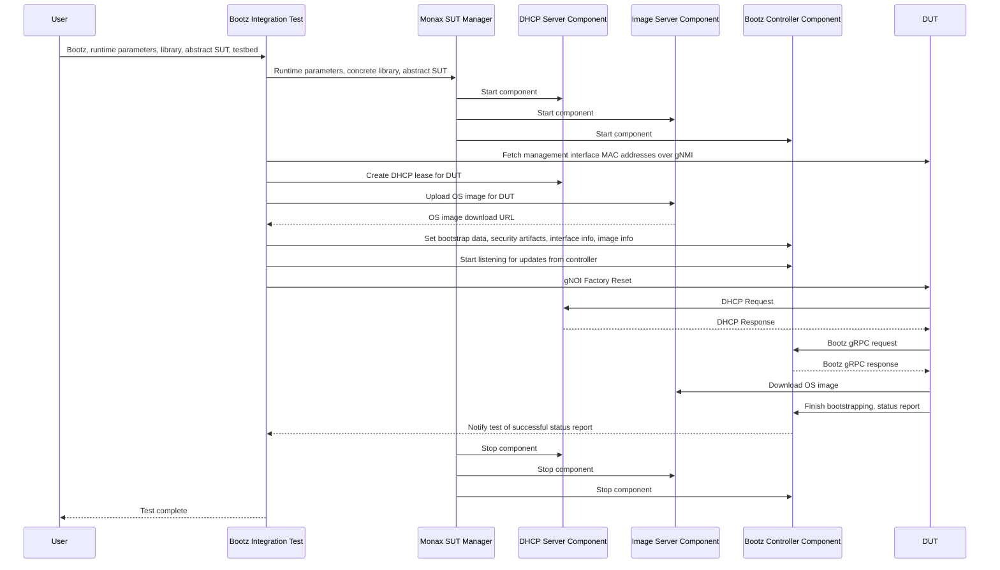

# Bootz Integration Test

This directory contains an integration test for the Bootz workflow using the
Monax framework.

## Glossary

- DUT: Device under test
- SUT: System under test

## Overview

The Bootz integration test consists of:

- A single DUT. This is the network device performing Bootz.
- A SUT containing three components:
  - A DHCP server for providing an initial DHCP lease to the DUT.
  - An image server for providing an HTTP download URL for the image.
  - A Bootz controller server which exposes two gRPC services:
    - A DUT-facing gRPC service that implements the `Bootz` RPCs (e.g.
      `GetBootstrapData()`)
    - A test-facing gRPC service that allows injection of test bootstrap
      data and fake errors.

A gRPC service interface is defined for each of the SUT components and each test
must provide an implementation that satisfies this interface. Example
implementations of these components are provided in this directory but test
runners are expected to fork and maintain their own SUT component
implementations. 

Below is a sequence diagram describing the integration test process:

## Implementing SUT components

The integration test expects exactly 4 gRPC components to be implemented and
configured by Monax. These are:

- DHCPService (`tests/proto/sut.proto`)
- ImageService (`tests/proto/sut.proto`)
- BootzController (`tests/proto/sut.proto`)
- Bootstrap (`proto/bootz.proto`)

Tip: It is not necessary to host each gRPC service on a separate
instance/server. It's suggested to host BootzController and Bootstrap services
on the same host so they can easily share state.

TODO(gmacf): Provide steps on implementing components.

## Configuring a test

The Bootz integration test contains 5 primary inputs:

- A `bootz.TestParameters` message for defining Bootz behavior.
- A Monax `AbstractSUT` message for defining the components within the test.
- A Monax `Library` message for defining the concrete implementation of the
  SUT components.
- A Monax `RuntimeParameters` message for defining the SUT environment.
- An Ondatra `Testbed` message for defining the DUT.

The Bootz TestParameters message is defined at `tests/proto/test.proto` and
configures the expected outcome of the test, the boot config to provide to the
DUT, which security artifacts to use and how to communicate with the DUT. This
message is provided via a textproto file which is specified in the
`--bootz_parameters` command line flag.

The three Monax input parameters are defined in the `openconfig/monax`
repository. See its documentation for more details on those inputs.

The Ondata `Testbed` message is defined in the `openconfig/ondatra` repository.
See its documentation for more details on this message.

## Running a test

TODO(gmacf): Update with running instructions
